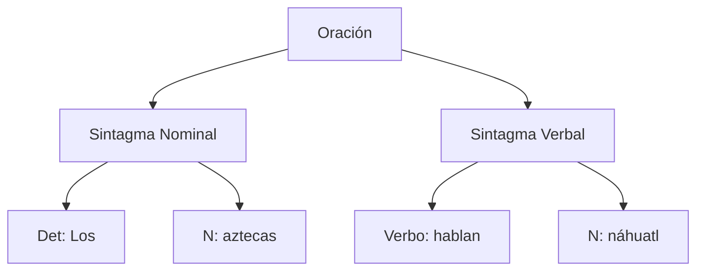

# Practica-Arbol-Derivacion
📖 Ejemplo: Oración 1
"Los aztecas hablan náhuatl"

```mermaid
graph TD
    O[Oración] --> SN[Sintagma Nominal]
    O --> SV[Sintagma Verbal]

    SN --> DET[Det: Los]
    SN --> N[N: aztecas]

    SV --> V[Verbo: hablan]
    SV --> N2[N: náhuatl]
```

